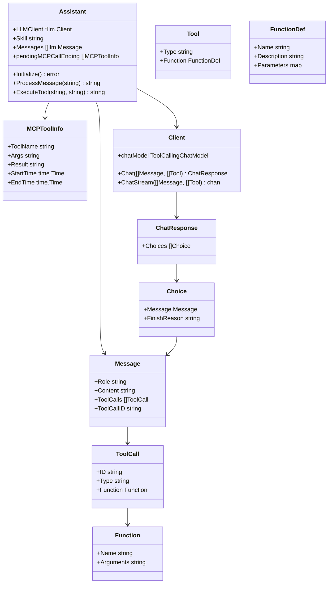
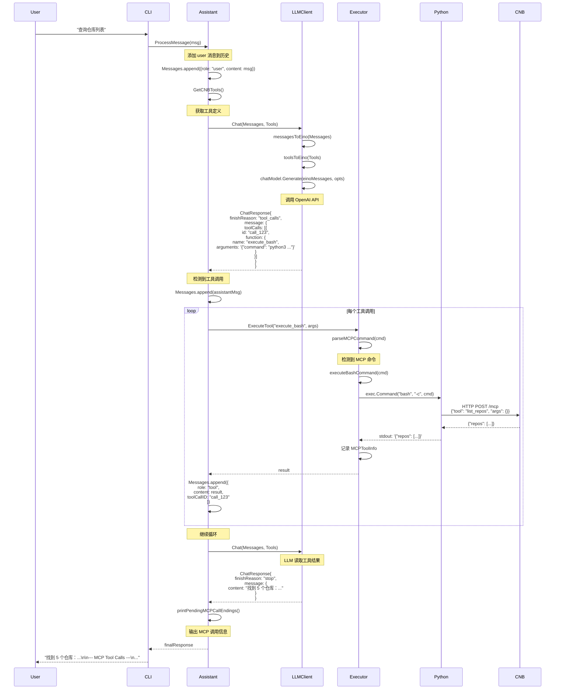
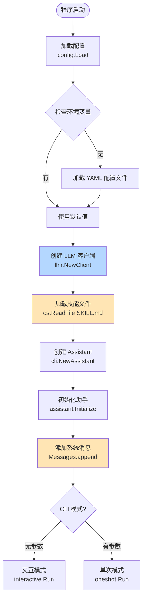

# Skill 系统架构详解

## 整体架构图

```mermaid
graph TB
    subgraph "1. 用户交互层"
        UI["用户输入"]
        CLI["CLI 路由<br/>main.go"]
        INTER["交互模式<br/>interactive.go"]
        ONE["单次模式<br/>oneshot.go"]
    end

    subgraph "2. 技能加载层"
        SKILL_FILE["技能文件<br/>skills/cnb-skill/SKILL.md<br/>Markdown + YAML"]
        LOAD["加载技能<br/>os.ReadFile"]
        SKILL_STR["技能内容字符串"]
    end

    subgraph "3. 助手初始化层"
        CONFIG["配置加载<br/>config.Load"]
        LLM_CLIENT["LLM 客户端<br/>eino-ext OpenAI"]
        ASSISTANT["Assistant 实例"]
        INIT["Initialize 方法"]
        SYS_MSG["系统消息<br/>role: system, content: skill"]
    end

    subgraph "4. 对话处理层"
        MSG_HISTORY["消息历史<br/>llm.Message 数组"]
        USER_MSG["用户消息<br/>role: user"]
        TOOLS["工具定义<br/>GetCNBTools"]
        TOOL_DEF["execute_bash 工具<br/>name, description, parameters"]
    end

    subgraph "5. LLM 调用层"
        CONVERT["消息格式转换<br/>messagesToEino"]
        EINO["eino ChatModel<br/>ToolCallingChatModel"]
        API["OpenAI API<br/>或兼容接口"]
        RESPONSE["LLM 响应<br/>content, tool_calls, finish_reason"]
    end

    subgraph "6. 工具调用决策"
        CHECK{"finish_reason?"}
        STOP["stop:<br/>返回文本响应"]
        TOOL_CALLS["tool_calls:<br/>需要执行工具"]
    end

    subgraph "7. 工具执行层"
        EXECUTOR["ExecuteTool<br/>executor.go"]
        PARSE_MCP["parseMCPCommand<br/>检测 MCP 命令"]
        BASH["executeBashCommand<br/>exec.Command"]
        MCP_INFO["MCPToolInfo<br/>记录 MCP 调用"]
    end

    subgraph "8. 外部集成层"
        PYTHON["Python 脚本<br/>cnb-mcp.py call"]
        MCP_API["MCP 协议请求"]
        CNB["CNB 平台 API"]
        RESULT["执行结果<br/>stdout/stderr"]
    end

    subgraph "9. 结果处理层"
        TOOL_MSG["工具消息<br/>role: tool, content: result"]
        APPEND["追加到消息历史"]
        LOOP{"达到最大迭代?"}
        PENDING["待输出 MCP 信息<br/>pendingMCPCallEnding"]
    end

    %% 连接关系
    UI --> CLI
    CLI --> INTER
    CLI --> ONE

    INTER --> CONFIG
    ONE --> CONFIG

    CONFIG --> LOAD
    LOAD --> SKILL_FILE
    SKILL_FILE --> SKILL_STR

    SKILL_STR --> ASSISTANT
    CONFIG --> LLM_CLIENT
    LLM_CLIENT --> ASSISTANT
    ASSISTANT --> INIT
    INIT --> SYS_MSG
    SYS_MSG --> MSG_HISTORY

    USER_MSG --> MSG_HISTORY
    MSG_HISTORY --> TOOLS
    TOOLS --> TOOL_DEF

    MSG_HISTORY --> CONVERT
    TOOL_DEF --> CONVERT
    CONVERT --> EINO
    EINO --> API
    API --> RESPONSE

    RESPONSE --> CHECK
    CHECK -->|stop| STOP
    CHECK -->|tool_calls| TOOL_CALLS

    TOOL_CALLS --> EXECUTOR
    EXECUTOR --> PARSE_MCP
    PARSE_MCP --> BASH
    BASH --> PYTHON
    PYTHON --> MCP_API
    MCP_API --> CNB
    CNB --> RESULT

    RESULT --> MCP_INFO
    MCP_INFO --> PENDING
    RESULT --> TOOL_MSG
    TOOL_MSG --> APPEND
    APPEND --> LOOP

    LOOP -->|否| CONVERT
    LOOP -->|是| STOP
    STOP --> PENDING

    style SKILL_FILE fill:#FFE5B4
    style SYS_MSG fill:#FFE5B4
    style TOOL_DEF fill:#B4D7FF
    style MCP_INFO fill:#D4FFB4
    style PENDING fill:#D4FFB4
```



---

## 详细流程说明

### 阶段 1: 技能定义与结构

**技能文件格式** (`skills/cnb-skill/SKILL.md`):

```markdown
---
name: cnb-skill
description: CNB 平台操作助手 - 帮助用户管理 CI/CD、代码仓库、流水线和查询文档
---

# CNB 平台操作助手

## 概述
你是一个专门用于 CNB 平台的智能助手...

## 配置要求
- CNB Token: 用于身份验证
- MCP URL: MCP 服务地址

## 工具调用方法
使用 `execute_bash` 工具执行以下格式的命令:
\`\`\`bash
python3 scripts/cnb-mcp.py call <tool_name> '<json_args>'
\`\`\`

## 功能矩阵
| 操作类型 | MCP 工具 | 示例 |
|---------|---------|------|
| 查询仓库列表 | list_repos | ... |
| 创建仓库 | create_repo | ... |

## 详细模块说明
### 1. 代码仓库管理
- list_repos: 列出所有仓库
  - 参数: ...
  - 示例: ...

### 2. 流水线管理
...

## 重要提示
- 使用 JSON 格式传递参数
- 检查错误信息
- 提供友好的响应

## 响应格式模板
...
```

**关键点**:
- **纯 Markdown 文档**: 不需要编译或解析
- **YAML Frontmatter**: 元数据（名称、描述）
- **自然语言指令**: 直接指导 LLM 行为
- **示例和最佳实践**: 帮助 LLM 理解上下文

---

### 阶段 2: 技能加载与注册

**文件**: `main.go` (lines 33-38)

```go
// 从磁盘加载技能文件
skillPath := filepath.Join("skills", "cnb-skill", "SKILL.md")
skillContent, err := os.ReadFile(skillPath)
if err != nil {
    return fmt.Errorf("failed to read skill file: %w", err)
}

// 创建助手实例，传入技能内容
assistant := cli.NewAssistant(llmClient, string(skillContent))
```

**文件**: `internal/cli/assistant.go` (lines 18-27)

```go
// Initialize 设置助手的系统提示词
func (a *Assistant) Initialize() error {
    // 将技能作为系统消息添加
    a.Messages = append(a.Messages, llm.Message{
        Role:    "system",
        Content: a.Skill,  // 整个技能 markdown 成为系统提示词
    })
    return nil
}
```

**流程**:
1. 读取 `SKILL.md` 文件为字符串
2. 创建 `Assistant` 实例，保存技能字符串
3. 调用 `Initialize()` 将技能作为 **系统消息** 添加到对话历史
4. 系统消息在整个会话中指导 LLM 行为

---

### 阶段 3: 工具定义

**文件**: `internal/cli/tools.go`

```go
func GetCNBTools() []llm.Tool {
    return []llm.Tool{
        {
            Type: "function",
            Function: llm.Function{
                Name:        "execute_bash",
                Description: "Execute a bash command and return the output. Use this for CNB platform operations via MCP.",
                Parameters: map[string]interface{}{
                    "type": "object",
                    "properties": map[string]interface{}{
                        "command": map[string]interface{}{
                            "type":        "string",
                            "description": "The bash command to execute. For CNB operations, use format: python3 scripts/cnb-mcp.py call <tool_name> '<json_args>'",
                        },
                    },
                    "required": []string{"command"},
                },
            },
        },
    }
}
```

**设计哲学**:
- **单一工具**: `execute_bash` 提供最大灵活性
- **约定优于配置**: 技能文档定义命令格式（不在代码中硬编码）
- **LLM 驱动**: LLM 根据技能指令决定执行什么命令

---

### 阶段 4: LLM 调用与工具执行循环

**文件**: `internal/cli/assistant.go` (lines 40-93)

```go
func (a *Assistant) ProcessMessage(userMessage string) (string, error) {
    // 1. 添加用户消息到历史
    a.Messages = append(a.Messages, llm.Message{
        Role:    "user",
        Content: userMessage,
    })

    // 2. 获取工具定义
    tools := GetCNBTools()

    // 3. 工具调用循环（最多 10 次迭代）
    maxIterations := 10
    for i := 0; i < maxIterations; i++ {
        // 4. 调用 LLM
        resp, err := a.LLMClient.Chat(a.Messages, tools)
        if err != nil {
            return "", fmt.Errorf("LLM call failed: %w", err)
        }

        assistantMsg := resp.Choices[0].Message
        finishReason := resp.Choices[0].FinishReason

        // 5. 添加助手消息到历史
        a.Messages = append(a.Messages, assistantMsg)

        // 6. 检查是否需要调用工具
        if finishReason == "tool_calls" && len(assistantMsg.ToolCalls) > 0 {
            // 7. 执行每个工具调用
            for _, toolCall := range assistantMsg.ToolCalls {
                result, err := a.ExecuteTool(
                    toolCall.Function.Name,
                    toolCall.Function.Arguments,
                )

                // 8. 将工具结果添加到消息历史
                a.Messages = append(a.Messages, llm.Message{
                    Role:       "tool",
                    Content:    toolResultContent,
                    ToolCallID: toolCall.ID,
                })
            }
            continue  // 继续循环，让 LLM 处理工具结果
        }

        // 9. 没有更多工具调用，返回最终响应
        a.printPendingMCPCallEndings()
        return assistantMsg.Content, nil
    }

    return "", fmt.Errorf("exceeded maximum iterations")
}
```

**关键机制**:
- **最大 10 次迭代**: 防止无限循环
- **工具结果反馈**: 工具输出添加到消息历史，LLM 可读取
- **多轮调用**: LLM 可以连续调用多个工具
- **自动重试**: 工具执行后自动请求 LLM 继续

---

### 阶段 5: 工具执行与 MCP 集成

**文件**: `internal/cli/executor.go`

#### 5.1 工具执行分发

```go
func (a *Assistant) ExecuteTool(toolName, argumentsJSON string) (string, error) {
    switch toolName {
    case "execute_bash":
        var args struct {
            Command string `json:"command"`
        }
        if err := json.Unmarshal([]byte(argumentsJSON), &args); err != nil {
            return "", fmt.Errorf("failed to parse arguments: %w", err)
        }

        // 检测是否是 MCP 命令
        mcpInfo := parseMCPCommand(args.Command)
        if mcpInfo != nil {
            mcpInfo.StartTime = time.Now()
        }

        // 执行 bash 命令
        result, err := executeBashCommand(args.Command)

        // 记录 MCP 调用信息
        if mcpInfo != nil {
            mcpInfo.EndTime = time.Now()
            mcpInfo.Result = result
            a.pendingMCPCallEnding = append(a.pendingMCPCallEnding, *mcpInfo)
        }

        return result, err

    default:
        return "", fmt.Errorf("unknown tool: %s", toolName)
    }
}
```

#### 5.2 MCP 命令检测

```go
func parseMCPCommand(command string) *MCPToolInfo {
    // 检测命令格式: python3 scripts/cnb-mcp.py call <tool_name> '<json_args>'
    re := regexp.MustCompile(`python3\s+scripts/cnb-mcp\.py\s+call\s+(\w+)\s+'([^']*)'`)
    matches := re.FindStringSubmatch(command)

    if len(matches) < 3 {
        return nil
    }

    toolName := matches[1]
    argsJSON := matches[2]

    return &MCPToolInfo{
        ToolName: toolName,
        Args:     argsJSON,
    }
}
```

#### 5.3 Bash 命令执行

```go
func executeBashCommand(command string) (string, error) {
    cmd := exec.Command("bash", "-c", command)

    var stdout, stderr bytes.Buffer
    cmd.Stdout = &stdout
    cmd.Stderr = &stderr

    err := cmd.Run()
    if err != nil {
        return "", fmt.Errorf("command failed: %s\nstderr: %s", err, stderr.String())
    }

    return stdout.String(), nil
}
```

**执行流程**:
```
LLM 调用工具
    ↓
ExecuteTool("execute_bash", '{"command": "python3 scripts/cnb-mcp.py call list_repos \'{}\'"}')
    ↓
parseMCPCommand() → 检测到 MCP 命令，提取 tool_name 和 args
    ↓
executeBashCommand() → exec.Command("bash", "-c", command)
    ↓
Python 进程启动
    ↓
cnb-mcp.py → 发送 MCP 请求到 CNB 平台
    ↓
CNB API 响应
    ↓
Python 输出 JSON 结果到 stdout
    ↓
Go 捕获 stdout → 返回给 LLM
    ↓
记录 MCPToolInfo（工具名、参数、结果、时间戳）
```

---

### 阶段 6: 消息流与上下文管理

**消息历史结构**:

```go
type Message struct {
    Role       string     // "system", "user", "assistant", "tool"
    Content    string     // 文本内容
    ToolCalls  []ToolCall // LLM 的工具调用（仅 assistant 消息）
    ToolCallID string     // 工具结果关联 ID（仅 tool 消息）
}
```

**典型消息序列**:

```
1. {role: "system", content: "<SKILL.md 完整内容>"}
   ↓
2. {role: "user", content: "查询 CNB 仓库列表"}
   ↓
3. {role: "assistant", content: "正在查询...", tool_calls: [{id: "call_123", function: {name: "execute_bash", arguments: '{"command": "python3 scripts/cnb-mcp.py call list_repos \\'{}\\'"}'}]}
   ↓
4. {role: "tool", content: '{"repos": [...]}', tool_call_id: "call_123"}
   ↓
5. {role: "assistant", content: "找到 5 个仓库：\n1. repo1\n2. repo2\n..."}
```

**关键点**:
- **系统消息持久化**: 技能文档在整个会话中保持在消息历史顶部
- **工具调用关联**: `ToolCallID` 确保工具结果与调用匹配
- **上下文累积**: 每次对话都基于完整历史，LLM 可以引用之前的结果

---

### 阶段 7: LLM 客户端与 eino 集成

**文件**: `internal/llm/client.go`

#### 7.1 客户端结构

```go
type Client struct {
    chatModel model.ToolCallingChatModel  // eino-ext 的 OpenAI 模型
}

func NewClient(apiKey, baseURL, modelName string) (*Client, error) {
    // 创建 eino-ext 的 OpenAI 客户端
    chatModel, err := openai.NewChatModel(ctx, &openai.ChatModelConfig{
        APIKey:  apiKey,
        BaseURL: baseURL,
        Model:   modelName,
    })

    return &Client{chatModel: chatModel}, nil
}
```

#### 7.2 消息格式转换

```go
func messagesToEino(messages []Message) []*schema.Message {
    var einoMessages []*schema.Message

    for _, msg := range messages {
        einoMsg := &schema.Message{
            Role:    msg.Role,
            Content: msg.Content,
        }

        // 转换工具调用
        if len(msg.ToolCalls) > 0 {
            for _, tc := range msg.ToolCalls {
                einoMsg.ToolCalls = append(einoMsg.ToolCalls, &schema.ToolCall{
                    ID:   tc.ID,
                    Type: tc.Type,
                    Function: &schema.FunctionCall{
                        Name:      tc.Function.Name,
                        Arguments: tc.Function.Arguments,
                    },
                })
            }
        }

        // 设置工具调用 ID
        if msg.ToolCallID != "" {
            einoMsg.ToolCallID = msg.ToolCallID
        }

        einoMessages = append(einoMessages, einoMsg)
    }

    return einoMessages
}
```

#### 7.3 LLM 调用

```go
func (c *Client) Chat(messages []Message, tools []Tool) (*ChatResponse, error) {
    // 转换消息格式
    einoMessages := messagesToEino(messages)

    // 转换工具定义
    einoTools := toolsToEino(tools)

    // 设置选项
    opts := []model.Option{
        model.WithTools(einoTools),
    }

    // 调用 eino 模型
    resp, err := c.chatModel.Generate(ctx, einoMessages, opts...)
    if err != nil {
        return nil, err
    }

    // 转换响应格式
    return einoToResponse(resp), nil
}
```

**eino 集成优势**:
- **模型抽象**: 可以轻松切换不同 LLM 提供商
- **工具调用标准化**: eino 处理 OpenAI function calling 协议
- **流式支持**: eino 提供流式生成能力
- **错误处理**: 统一的错误处理机制

---

### 阶段 8: MCP 调用追踪与透明化

**文件**: `internal/cli/types.go`

```go
type MCPToolInfo struct {
    ToolName  string    // MCP 工具名称
    Args      string    // JSON 参数
    Result    string    // 执行结果
    StartTime time.Time // 开始时间
    EndTime   time.Time // 结束时间
}

type Assistant struct {
    // ...
    pendingMCPCallEnding []MCPToolInfo  // 待输出的 MCP 调用信息
}
```

**输出格式化** (`executor.go`):

```go
func (a *Assistant) printPendingMCPCallEndings() {
    if len(a.pendingMCPCallEnding) == 0 {
        return
    }

    fmt.Println("\n--- MCP Tool Calls ---")
    for _, info := range a.pendingMCPCallEnding {
        duration := info.EndTime.Sub(info.StartTime)
        fmt.Printf("Tool: %s\n", info.ToolName)
        fmt.Printf("Args: %s\n", info.Args)
        fmt.Printf("Duration: %v\n", duration)
        fmt.Printf("Result: %s\n", info.Result)
        fmt.Println("---")
    }

    // 清空列表
    a.pendingMCPCallEnding = []MCPToolInfo{}
}
```

**用户体验**:
```
用户: 查询仓库列表
助手: 找到 5 个仓库：
1. repo1
2. repo2
...

--- MCP Tool Calls ---
Tool: list_repos
Args: {}
Duration: 1.2s
Result: {"repos": [...]}
---
```

**设计目标**:
- **透明性**: 用户可以看到实际执行的 MCP 调用
- **调试**: 帮助用户理解系统行为
- **性能监控**: 显示每个 MCP 调用的耗时

---

## 核心数据结构关系图



---

## 技能系统设计哲学

### 1. 最小化原则
- **单一工具**: `execute_bash` 足够灵活
- **纯文档技能**: 无需编译或特殊解析
- **约定优于配置**: 命令格式在技能文档中定义

### 2. 透明性
- **消息历史可见**: 所有对话保留在历史中
- **MCP 调用追踪**: 用户看到实际执行的操作
- **错误信息传递**: LLM 读取错误并决定如何处理

### 3. LLM 驱动
- **决策权**: LLM 决定何时调用工具、传递什么参数
- **自适应**: LLM 根据结果调整后续行为
- **错误恢复**: LLM 可以重试或采取替代方案

### 4. 模块化
- **清晰分层**: CLI → Assistant → LLM Client → Executor → External
- **松耦合**: 各层通过接口通信
- **可扩展**: 易于添加新工具或集成新 LLM

---

## 关键拦截点与扩展点

### 1. 系统提示词注入
**位置**: `assistant.Initialize()`
**用途**: 注入技能文档作为系统消息
**扩展**: 可动态修改技能内容或添加上下文

### 2. 工具定义注入
**位置**: `assistant.ProcessMessage()` → `GetCNBTools()`
**用途**: 定义 LLM 可用的工具
**扩展**: 可根据上下文动态添加/移除工具

### 3. 工具调用检测
**位置**: `assistant.ProcessMessage()` → `finishReason == "tool_calls"`
**用途**: 拦截 LLM 的工具调用意图
**扩展**: 可添加权限检查、参数验证

### 4. 工具执行包装
**位置**: `executor.ExecuteTool()`
**用途**: 统一工具执行入口
**扩展**: 可添加日志、监控、限流

### 5. MCP 命令检测
**位置**: `executor.parseMCPCommand()`
**用途**: 识别和解析 MCP 命令
**扩展**: 可支持更多命令格式或协议

### 6. 工具结果处理
**位置**: `assistant.ProcessMessage()` → 添加 tool 消息
**用途**: 将工具结果反馈给 LLM
**扩展**: 可过滤、转换或增强结果

### 7. 消息历史管理
**位置**: `assistant.Messages`
**用途**: 维护对话上下文
**扩展**: 可实现历史压缩、总结、持久化

---

## 完整执行时序图



---

## 配置与初始化流程



---

## 总结：技能系统的核心价值

### 为什么这个架构有效？

1. **简洁性**:
   - 技能 = Markdown 文档
   - 工具 = 单个 bash 执行器
   - 集成 = 标准化的消息协议

2. **灵活性**:
   - LLM 决策驱动（不是硬编码规则）
   - 技能文档可快速迭代
   - 易于添加新操作（修改 Python 脚本）

3. **可观测性**:
   - 完整消息历史
   - MCP 调用追踪
   - 时间戳和性能数据

4. **可扩展性**:
   - 清晰的模块边界
   - 松耦合的组件
   - 标准化的接口

### 适用场景

这个架构特别适合：
- **平台 API 包装**: 通过 LLM 提供自然语言接口
- **工作流自动化**: 多步骤操作编排
- **开发者工具**: CLI 增强（如 git、docker 等）
- **内部工具**: 企业系统集成

### 扩展方向

可以在此基础上扩展：
- **多技能支持**: 动态加载不同技能
- **技能组合**: 组合多个技能解决复杂任务
- **权限管理**: 基于用户角色限制工具访问
- **持久化**: 保存对话历史和上下文
- **分布式**: 跨多个 agent 协作
